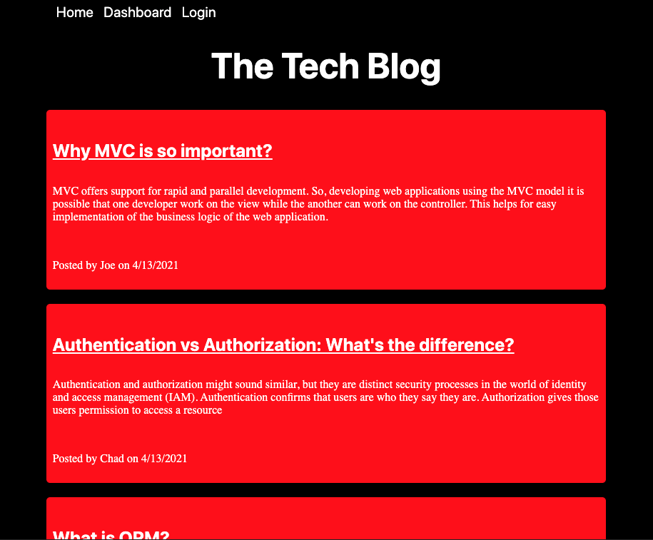
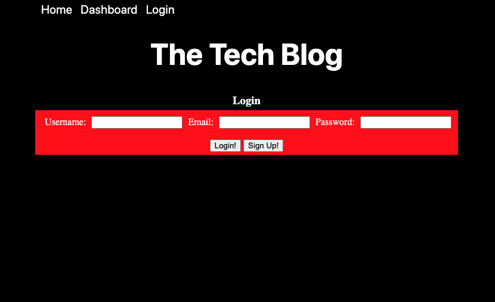

# Tech-Blog

## Deployed Application Link

[Tech-Blog](https://murmuring-scrubland-24732.herokuapp.com/)

## Table of Contents

* [Purpose](#Purpose)

* [Technologies](#Technologies)

* [Instructions](#Instructions)

* [Contact](#Contact)

* [License](#License)

## Purpose

A full stack application that allows the user to first create an account or login if an account has already been created. The user then can see posts on the homepage and with the ability to interact with them and leave comments under their username. Navigating to the dashboard option in the navbar will allow the user when signed in to see their own posts, from there they can edit/update or delete their posts. A logout button is located in the navbar when the user is on the their dashboard page. 

All data is stored within a database and served up through api functions. 

## Technologies

* ***Nodejs***
* ***Handlebars***
* ***Sequelize*** 
* ***Express*** 
* ***Bcrypt***
* ***JavaScipt***
* ***MySQL2***
* ***SQL***
* ***API***

## Instructions

The live deployed app will take care of the user (no instructions needed)

However if it was needed to run the application locally:

1. Clone the repository on a local machine.
2. Open the apps directory and run a `npm install` to get all dependencies.
3. Using MySQL client, run the db schema to build the database. 
4. Create an `.env` file that will store your personal credentials. Follow the `.env.EXAMPLE` model to ensure correct key/value pairs.
5. In the command line run `npm run start` to get the server up and running, from there navigate to a browser of choice and access the app by going to `localhost:3001`.
6. If new to the application you will have to sign up and fill out the required fields. 
7. Blog away!

## Contact

* [Email](mailto:josephjlyons90@gmail.com)
* [LinkedIn](www.linkedin.com/in/joseph-lyons-0a2630200/)

## License

Copyright (c) [2021] [Joseph Lyons]
Permission is hereby granted, free of charge, to any person obtaining a copy of this software and associated documentation files (the "Software"), to deal in the Software without restriction, including without limitation the rights to use, copy, modify, merge, publish, distribute, sublicense, and/or sell copies of the Software, and to permit persons to whom the Software is furnished to do so, subject to the following conditions:

The above copyright notice and this permission notice shall be included in all copies or substantial portions of the Software.

THE SOFTWARE IS PROVIDED "AS IS", WITHOUT WARRANTY OF ANY KIND, EXPRESS OR IMPLIED, INCLUDING BUT NOT LIMITED TO THE WARRANTIES OF MERCHANTABILITY, FITNESS FOR A PARTICULAR PURPOSE AND NONINFRINGEMENT. IN NO EVENT SHALL THE AUTHORS OR COPYRIGHT HOLDERS BE LIABLE FOR ANY CLAIM, DAMAGES OR OTHER LIABILITY, WHETHER IN AN ACTION OF CONTRACT, TORT OR OTHERWISE, ARISING FROM, OUT OF OR IN CONNECTION WITH THE SOFTWARE OR THE USE OR OTHER DEALINGS IN THE SOFTWARE.
